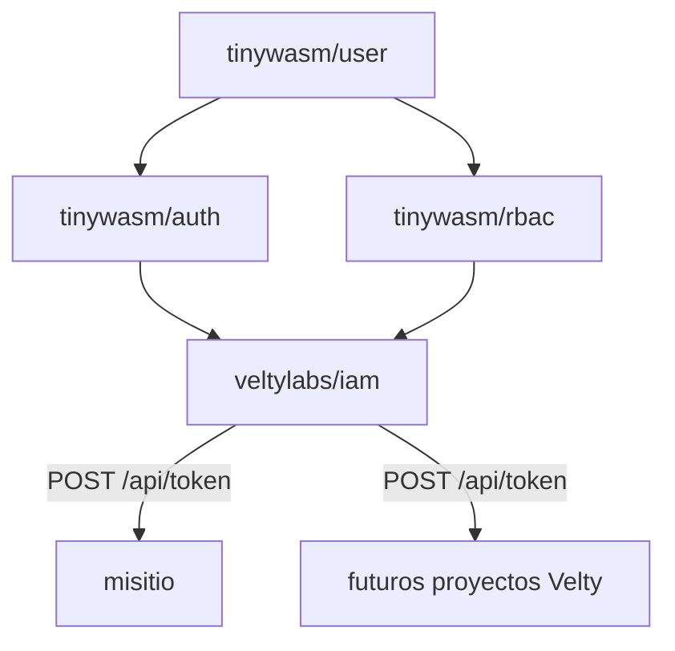

# iam


Servicio central de identidad, sesión SSO y RBAC para todos los proyectos de
Velty. Reemplaza el patrón actual — cada app monta su propio
`tinywasm/auth` + `tinywasm/rbac` contra su propia base — por un servicio
único que las apps consumidoras llaman por HTTP.

Motor: usa `tinywasm/user` + `tinywasm/auth` + `tinywasm/rbac` sin
modificarlas (son librerías genéricas ya publicadas, compartidas con
cualquier otro consumidor del ecosistema). `iam` es la nueva raíz de
composición que hoy vive duplicada — y desincronizada — en cada app: ver
[`docs/ARCHITECTURE.md`](docs/ARCHITECTURE.md) §1 para la evidencia concreta.



## Uso desde otro proyecto

```go
import iamclient "github.com/veltylabs/iam/client"

iam, err := iamclient.New(iamclient.ConfigFromEnv(ProjectID))
if err != nil { /* no arrancar */ }

r := edge.NewRouter(edge.Config{
    Authn:     iam.Authn(),
    Authorize: myPolicy(iam),   // política del proyecto, no de iam
})
```

`iam` entrega códigos de rol (`Scope`); el proyecto entrega la política.
`Consumer.AssignRole` concede un rol en el proyecto del `Consumer` y es
idempotente.

## Documentación

- [Arquitectura](docs/ARCHITECTURE.md) — por qué existe, límites de
  responsabilidad frente a `site_manager`, decisiones tomadas y lo que
  queda deliberadamente abierto.

## Estado

Motor de identidad+RBAC portado y con `project_id` nativo (Etapas 1-2). API
Bearer con tokens de autorización por proyecto y cookie SSO entre
`*.velty.cl` (Etapas 3-4) — todo ejecutado. Pendiente: que `misitio` (u
otra app) consuma `iam` remotamente en vez de montar su propio
`authority.Module`/`rbac.Service`, y un panel de administración propio —
ver `docs/ARCHITECTURE.md` §8.
