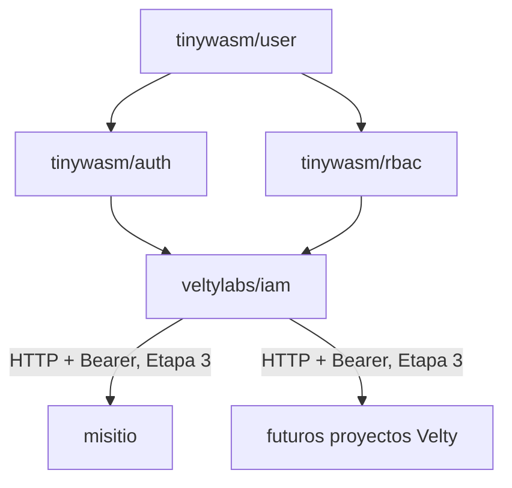

# iam

Servicio central de identidad, sesión SSO y RBAC para todos los proyectos de
Velty. Reemplaza el patrón actual — cada app monta su propio
`tinywasm/auth` + `tinywasm/rbac` contra su propia base — por un servicio
único que las apps consumidoras llaman por HTTP.

Motor: usa `tinywasm/user` + `tinywasm/auth` + `tinywasm/rbac` sin
modificarlas (son librerías genéricas ya publicadas, compartidas con
cualquier otro consumidor del ecosistema). `iam` es la nueva raíz de
composición que hoy vive duplicada — y desincronizada — en cada app: ver
[`docs/ARCHITECTURE.md`](docs/ARCHITECTURE.md) §1 para la evidencia concreta.

## Documentación

- [Arquitectura](docs/ARCHITECTURE.md) — por qué existe, límites de
  responsabilidad frente a `site_manager`, decisiones tomadas y lo que
  queda deliberadamente abierto.
- [Plan](docs/PLAN.md) — etapas de implementación.

## Estado

Motor de identidad+RBAC portado y con `project_id` nativo (Etapas 1-2,
ejecutadas). Etapas 3 (API Bearer, tokens de autorización por proyecto) y
4 (cookie SSO entre `*.velty.cl`) tienen plan listo para ejecutar, sin
código todavía — ver [`docs/PLAN.md`](docs/PLAN.md).
