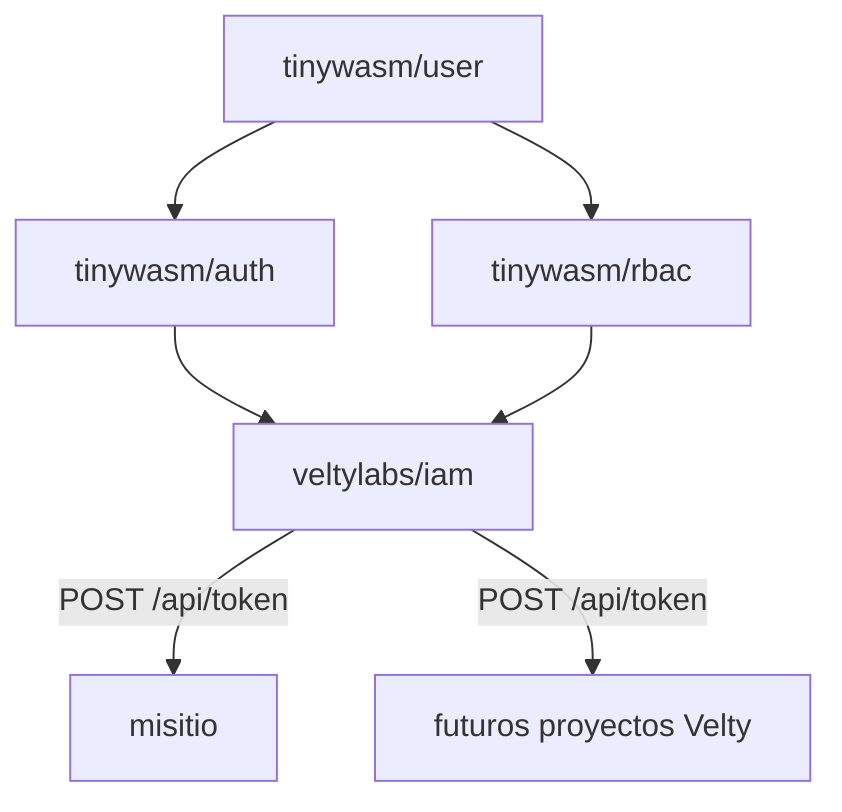

# iam


Servicio central de identidad, sesión SSO y RBAC para todos los proyectos de
Velty. Reemplaza el patrón actual — cada app monta su propio
`tinywasm/auth` + `tinywasm/rbac` contra su propia base — por un servicio
único que las apps consumidoras llaman por HTTP.

Motor: usa `tinywasm/user` + `tinywasm/auth` + `tinywasm/rbac` sin
modificarlas (son librerías genéricas ya publicadas, compartidas con
cualquier otro consumidor del ecosistema). `iam` es la nueva raíz de
composición que hoy vive duplicada — y desincronizada — en cada app: ver
[`docs/ARCHITECTURE.md`](docs/ARCHITECTURE.md) §1 para la evidencia concreta.



## Uso desde otro proyecto

```go
import iamclient "github.com/veltylabs/iam/client"

iam, err := iamclient.New(iamclient.ConfigFromEnv(ProjectID))
if err != nil { /* no arrancar */ }

r := edge.NewRouter(edge.Config{
    Authn:     iam.Authn(),
    Authorize: myPolicy(iam),   // política del proyecto, no de iam
})
```

`iam` entrega códigos de rol (`Scope`); el proyecto entrega la política.
`Consumer.AssignRole` concede un rol en el proyecto del `Consumer` y es
idempotente (un `roleCode` inexistente devuelve error: los roles se definen
en el panel, no desde los consumidores). Los proyectos y sus `client_secret`
se administran desde el panel propio (`/` en `iam.velty.cl`).

## Desarrollo local (sin credenciales)

El servidor local no necesita nada de Google ni de Cloudflare: usa
identidades mock y base en memoria.

```bash
go run ./web            # http://localhost:8080 (o -server_port XXXX)
go test ./tests/...     # suite completa
GOOS=js GOARCH=wasm go build ./edge/ ./web/   # compuerta TinyGo
```

Abrí http://localhost:8080 y entrá con la identidad local
(`admin@iam.local` — ya es administradora del panel, sin configurar
`IAM_ADMIN_EMAILS`). El origen del panel en local es
`http://localhost:8080` por defecto. Verificado: `/api/health` y
`/api/health/db` responden `{"ok":true}`, `/api/admin/me` sin sesión da
401, y las respuestas llevan las seis cabeceras de seguridad.

## Publicar (con credenciales reales)

Checklist única y ordenada en [docs/DEPLOY.md](docs/DEPLOY.md): 3 secrets
de GitHub (`CLOUDFLARE_ACCOUNT_ID`, `CLOUDFLARE_API_TOKEN`,
`D1_DATABASE_ID`), 6 variables de ejecución en Cloudflare (las 3 de
Google, `JWT_SECRET`, `IAM_PANEL_ORIGIN`, `IAM_ADMIN_EMAILS`), cabeceras
de seguridad para los assets estáticos (§3b), push a `main` y verificación
con `curl`. Probá todo en local (sección anterior) antes de cargar las
credenciales reales.

## Documentación

- [Arquitectura](docs/ARCHITECTURE.md) — por qué existe, límites de
  responsabilidad frente a `site_manager`, decisiones tomadas y lo que
  queda deliberadamente abierto.
- [Diseño](docs/DESIGN.md) — decisiones justificadas y alternativas
  descartadas (hoy: por qué `client_secret` y no un "token").

## Estado

Motor de identidad+RBAC portado y con `project_id` nativo (Etapas 1-2). API
Bearer con tokens de autorización por proyecto y cookie SSO entre
`*.velty.cl` (Etapas 3-4) — todo ejecutado. `veltylabs/misitio` ya consume
`iam` remotamente (dejó de montar su propio `authority.Module`/`rbac.Service`).
Panel de administración completo (proyectos, lifecycle de `client_secret`,
roles, usuarios y auditoría), servido por el mismo Worker con acceso controlado
por `IAM_ADMIN_EMAILS` y transporte REST. El servicio pasó una auditoría de
seguridad completa (open redirect, cabeceras, CSRF entre subdominios hermanos
y auditoría de denegaciones) y la cadena de librerías compartidas aguas arriba
se corrigió en sus propios repos.
