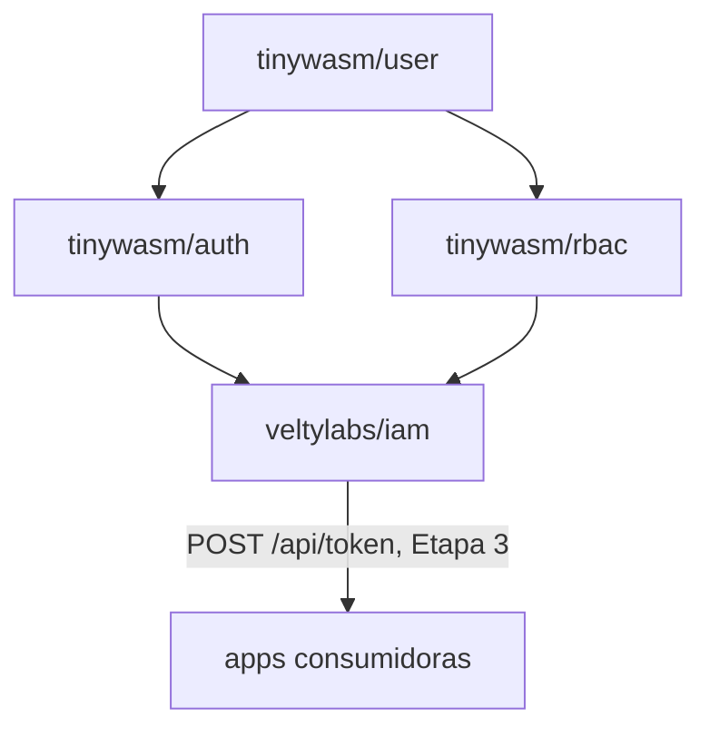

# Arquitectura de `iam`

Define **qué** es este servicio y **por qué** existe.

---

## 1. El problema

`tinywasm/user` / `tinywasm/auth` / `tinywasm/rbac` son librerías genéricas
(separadas en repos hermanos el 2026-08-23). Resuelven "no reescribir la
mecánica de login y permisos en cada app". No resuelven esto otro: **cada
app sigue siendo su propia raíz de composición**, con su propia base de
datos de usuarios/roles.

Evidencia concreta, verificada en código el 2026-08-24:

- `veltylabs/misitio/edge/main.go` monta `authority.Module` + `rbac.Service`
  in-process contra la D1 `velty-misitio-db` (ver
  [`edge/main.go`](https://github.com/veltylabs/misitio/blob/main/edge/main.go)).
- `veltylabs/mjosefa-cms` monta su propio auth contra postgres, con
  `github.com/tinywasm/user v0.0.38` — anterior al split de `auth`/`rbac`
  (`user` va hoy en `v0.3.11`). Cada app que se suma reimplementa el mismo
  cableado y diverge en versión.

`iam` es la raíz de composición **única**: construye el motor una sola vez
y lo expone por HTTP (Etapa 3) para que ninguna app nueva vuelva a montar
`authority.Module`/`rbac.Service` contra su propia base. `routes.Register`
sirve como la raíz de composición de rutas HTTP del servidor — es el único
lugar donde se invocan los métodos `MountAPI` de cualquier `router.APIModule`
(ej. `authority.Module` con `/oauth/*` y `/logout`).

### 1.1 — Reconciliación del esquema en tiempo de despliegue

`NewProductionBackend` asume que la base de datos ya tiene el esquema creado y
**no realiza ninguna I/O de DDL ni reconciliación de tablas al arrancar**.
Esto reduce el tiempo de arranque en frío (*cold start*) de los Cloudflare
Workers de ~8.5–10.4 s a milisegundos.

La reconciliación del esquema de la base de datos (tablas de `authority`,
`rbac` y `projects`) se ejecuta de manera única en tiempo de despliegue desde
CI usando el binario `cmd/migrate` contra la API HTTP de D1 (`NewD1Migrator`).

## 2. Qué NO es `iam`

- **No es un fork de `tinywasm/auth`/`tinywasm/rbac`.** Las importa sin
  modificarlas — ver [no-usar-`internal/`](#) (regla del ecosistema: un
  módulo propio no duplica una dependencia, la usa o le contribuye aguas
  arriba).
- **No reemplaza la autorización fina de negocio de cada app.** Ver §4.

## 3. Decisiones tomadas (2026-08-24)

Resueltas en conversación con el mantenedor antes de escribir código.

### 3.1 — Nombre: `veltylabs/iam`

*Identity and Access Management*: término estándar de la industria para un
servicio que junta login + RBAC + multi-proyecto. Va bajo `veltylabs/`, no
`tinywasm/`, porque no es un framework genérico reusable fuera de Velty
(como sí lo son `auth`/`rbac`) sino una decisión de infraestructura propia
de Velty — mismo patrón que `site_manager`/`site_content` (negocio) frente
a `tinywasm/*` (framework).

### 3.2 — SSO real entre subdominios

**SSO (Single Sign-On, "inicio de sesión único"):** el usuario se loguea
**una vez** y esa sesión sirve automáticamente en otras aplicaciones, sin
volver a pedir credenciales en cada una.

Una sesión iniciada en un proyecto debe servir automáticamente en los
demás: dominio compartido (`iam.velty.cl` u otro subdominio bajo
`*.velty.cl`) emite la sesión; cada app la valida vía cookie de dominio
padre `.velty.cl` o JWT. El usuario entra una vez y accede a todo lo que
tenga membresía.

**Consecuencia:** todo proyecto Velty futuro debe vivir bajo `*.velty.cl`
para participar del SSO. Un proyecto en dominio propio ajeno necesitaría un
mecanismo distinto (fuera de alcance por ahora).

**Estado: ejecutada.** El mecanismo concreto es cookie de dominio padre
(`Domain: ".velty.cl"`, no JWT portado entre dominios) — ver §7.

### 3.3 — Roles con ámbito por proyecto

Cada asignación de rol lleva un `project_id`: un usuario puede ser admin en
`misitio` y no tener ningún rol en `mjosefa-cms`. Encaja con "una base de
datos para todos los proyectos" — permite que un mismo usuario tenga
distinto nivel de acceso en cada proyecto sin bases separadas.

**Estado: parcialmente resuelto.** La decisión de *producto* (roles
aislados por proyecto) está tomada. La decisión de *esquema* — cómo se
particiona físicamente `tinywasm/rbac` por proyecto sin modificar esa
librería (columna `project_id` compartida vs. una instancia lógica de
`rbac.Service` por proyecto sobre particiones de datos separadas) — **no
está tomada**. Es la Etapa 2. Ver §5.

### 3.4 — Límite de responsabilidad frente a `site_manager`

`misitio` ya tiene su propio nivel de autorización fino: `SiteMember` en
`veltylabs/site_manager` decide qué cliente administra qué sitio. `iam`
**no reemplaza eso**. `iam` resuelve únicamente:

1. "¿Quién eres?" (identidad, vía Google OAuth).
2. "¿Qué proyectos puedes usar y con qué rol general en cada uno?" (RBAC de
   alto nivel, con ámbito `project_id`).

La autorización fina de negocio (qué sitio administra este cliente, qué
plan tiene) se queda en `site_manager`, que sigue siendo quien la
consulta — solo que el motor de identidad que usa para resolver "qué
usuario es este" pasa a ser `iam` en vez de una copia local.

**Consecuencia práctica verificada en código:** `misitio/config/admin.go`
tiene hoy `EnsureAdminRoleRBAC`, que mezcla dos cosas — crear el rol
`Velty Admin` y asignarlo por email (mecánica genérica, sí pertenece a
`iam`) **y** crear los permisos `ResourceAccessReq`/`ResourceSite`
(política de negocio de `site_manager`, no pertenece a `iam`). La Etapa 1
solo porta la mecánica genérica; `misitio` sigue siendo quien declara sus
propios permisos, ahora llamando al cliente de `iam` en vez de a
`rbac.Service` local (ese cambio en `misitio` es un plan aparte, no
incluido aquí — ver §6).

## 4. Terminología: "proyecto" no es "tenant"

`misitio` ya usa la palabra **tenant** con un significado propio y
verificado en código: el cliente final de Velty, aislado por `site_id` vía
`SiteMember` (`veltylabs/misitio/tests/tenant_test.go`, casos T1-T3). Es un
nivel de aislamiento *dentro* de un proyecto.

`iam` introduce un nivel de aislamiento *entre* proyectos (`misitio` vs.
`mjosefa-cms` vs. futuros). Para no chocar con el significado ya
establecido, `iam` usa siempre la palabra **proyecto** (`project_id`) para
su propio nivel de ámbito, y nunca "tenant". Un lector que conozca ambos
repos no debe confundir "tenant de `iam`" con "tenant de `misitio`" —
son capas distintas.

## 5. Etapa 2 — `project_id` (CERRADA, 2026-08-24)

Se eligió (a): columna `project_id` nativa en las 4 tablas de
`tinywasm/rbac` (`Role`/`Permission`/`UserRole`/`RolePermission`), parte de
la clave primaria — no una partición paralela dentro de `iam`. Ejecutada
junto con la limpieza de la duplicación bidireccional que dejó el split
`user`/`auth`/`rbac`: ver
[[iam-bootstrap-and-rbac-split-cleanup]] (memoria) y
`tinywasm/rbac` `v0.0.3`. `TestProjectsAreIsolated` en `tinywasm/rbac/tests`
es la prueba que valida el aislamiento entre proyectos.

## 6. Etapa 3 — API Bearer para consumidores remotos (EJECUTADA, 2026-08-24)

### 6.1 — Dos tokens, no uno

Un solo JWT no puede servir ambos propósitos: la cookie de identidad
(Etapa 4) viaja a **todo** `*.velty.cl` y por tanto no puede llevar roles
de un proyecto específico — cualquier otro proyecto bajo el mismo dominio
la recibiría también. Se separan:

- **Token de identidad** (Etapa 4): solo `Sub`/`Exp`/`Iat` — prueba "quién
  eres", nada más. Es exactamente `tinyjwt.Claims`, sin cambios.
- **Token de autorización** (esta etapa): además de identidad, lleva
  `Aud` (project_id) + `Scope` (códigos de rol) — una app lo pide a `iam`
  cuando lo necesita, nunca es la cookie compartida. Por qué son claims
  JWT estándar y no campos caseros de RBAC: ver §6.2.

### 6.2 — El payload de autorización usa claims JWT estándar, no campos caseros de RBAC

`tinywasm/jwt`'s `Claims` declara explícitamente en su propio código:
*"Closed on purpose: the registered claims this ecosystem actually uses.
No `map[string]any` bag — that is how JWT libraries grow holes."* Agregarle
campos con nombres de dominio propio (`ProjectID`, `Roles`) violaría esa
intención — acoplaría la capa más base (de la que `auth` depende) al
concepto de RBAC, la misma clase de acoplamiento que se limpió en la
Etapa 1/2, un nivel más abajo.

En vez de eso, `Claims` gana dos campos con **nombres registrados del
propio estándar JWT/OAuth2**: `Aud` (*audience* — claim registrado en el
RFC 7519, "a quién va dirigido el token") y `Scope []string` (qué permite
— término que ya usa `tinywasm/git/github_auth.go` para OAuth, no un
invento de esta sesión). `iam` los puebla con `project_id` y los códigos
de rol respectivamente; `tinywasm/jwt` nunca ve esas palabras, solo ve
"audience" y "scope" — el vocabulario que el estándar ya anticipó para
exactamente este caso. Sin tipo nuevo, sin mecanismo de firma paralelo:
`Sign`/`Verify`/`NewClaims` existentes siguen funcionando sin cambios para
el caso de identidad pura; una `NewScopedClaims` nueva puebla también
`Aud`/`Scope` (`tinywasm/jwt` `v0.1.16`).

**Se consideraron 3 opciones antes de esta** (registro para no repetir el
análisis): (a) extender `Claims` con `ProjectID`/`Roles` directo — mismo
costo bajo que la elegida, pero acopla la capa base a terminología de
RBAC; (b) no tocar `Claims`, generalizar `Sign`/`Verify` sobre cualquier
payload y definir un tipo `AuthClaims` separado en `iam` — evita cualquier
acoplamiento pero duplica el mecanismo de firma (dos rutas a mantener) para
un problema que hoy solo tiene un consumidor (`auth`, verificado). Se
eligió (c), este apartado, por dar la simplicidad de (a) sin su costo de
acoplamiento semántico.

### 6.3 — TTL diferenciado por rol

`rbac.Role` gana un campo `SessionTTL int64` (0 = usar el default). El
default es **30 minutos**. Al emitir un token de autorización, `iam` usa
el **más restrictivo** (menor) entre los `SessionTTL` de los roles que el
usuario tiene en ese proyecto — cerrado por defecto: un rol sin
`SessionTTL` declarado no alarga la sesión de otro rol más sensible.

**Por qué no revocación explícita:** un TTL corto + renovación automática
acota la ventana de "rol revocado pero token aún vivo" a, como mucho, el
TTL vigente — sin necesitar una lista de tokens revocados consultada en
cada verificación. Se revisita si aparece un caso real que lo exija.

### 6.4 — Autenticación de la app: client credentials por proyecto

> Por qué se llama `client_secret` y no "token", y cómo lo nombra la
> industria en general: [`DESIGN.md`](DESIGN.md) §1.

La cookie de identidad prueba quién es el **usuario**, no que la app que
la reenvía es realmente `misitio` y no un sitio impostor bajo el mismo
dominio padre. Cada proyecto registrado en `iam` recibe un `client_id` +
`client_secret` (estilo OAuth2 client credentials) al darse de alta. El
endpoint que emite el token de autorización exige ambas cosas: la cookie
de identidad (quién es el usuario) y el secreto del proyecto (qué app lo
pide). Sin el secreto, cualquier código bajo `*.velty.cl` podría pedir
tokens para un proyecto ajeno.

**Server-to-server, nunca desde el navegador.** `client_secret` no puede
vivir en un bundle WASM/JS que el usuario puede inspeccionar — eso
anularía por completo la protección de este apartado. Quien llama a
`POST /api/token` es siempre el **servidor** del proyecto consumidor
(nunca `fetch()` desde el cliente): recibe la cookie SSO en su propia
request entrante (Domain `.velty.cl` la trae automáticamente, sin código
adicional) y la reenvía él mismo a `iam`, junto con su `client_secret`
guardado como variable de entorno del servidor. `POST /api/token` por
tanto **no lleva CORS** — no hay llamador cross-origin que necesite esas
cabeceras. `veltylabs/iam/client` es el cliente HTTP que hace exactamente
esto (`FetchAuthzToken`), para que cada consumidor no reimplemente el
mecanismo.

**La respuesta también lleva el perfil básico** (`email`/`name`/`avatar`),
no solo el token — `misitio` (y cualquier consumidor sin tabla de usuarios
propia) necesita mostrar "Hola, &lt;nombre&gt;" sin una segunda llamada.
Esto vive FUERA del JWT (`Claims` sigue cerrado — ver §6.2): son campos de
la respuesta HTTP de `/api/token`, no claims firmados. `iam` ya resuelve
esto con `authMod.GetUser(userID)`, mismo mecanismo que usaba internamente
antes de esta etapa.

## 7. Etapa 4 — SSO cross-dominio (EJECUTADA, 2026-08-24)

- **Mecanismo:** cookie de dominio padre `.velty.cl`, no JWT portado por
  redirect. `router.Cookie` ya declara un campo `Domain` (sin usar hoy por
  `auth/session/jwt.Strategy`); `SameSite=Strict` funciona entre
  subdominios del mismo sitio registrable (`velty.cl`), así que no hace
  falta relajarlo a `Lax`/`None`. El navegador la envía solo a `*.velty.cl`,
  sin código adicional en cada app consumidora.
- **Subdominio de `iam`:** `iam.velty.cl` — coherente con el patrón ya
  usado (`misitio.velty.cl`), en la misma zona/cuenta Cloudflare "velty"
  (ver memoria `cloudflare-velty-cl-worker`).
- **TTL de la cookie de identidad:** 7 días — igual al `TTLSession` que ya
  usan `iam`/`misitio` para su cookie de sesión local hoy. No arriesga
  permisos obsoletos (no lleva roles), así que puede ser más largo que el
  token de autorización.
- **Volver al consumidor tras el login:** el usuario entra a `iam` desde
  `misitio` (u otro proyecto), no directamente — tras loguearse necesita
  volver adonde estaba, no quedarse en `iam.velty.cl`. `iam` inicia el
  login con `/oauth/google?redirect_uri=<url del consumidor>`
  (`tinywasm/auth/oauth2` `v0.0.8`, `oauth2.WithRedirectValidator`): el
  valor pasa por `isVeltyDomain` (mismo criterio que el resto de este
  documento — host `velty.cl` o subdominio suyo) antes de aceptarse, vía
  una cookie de un solo uso (`oauth_redirect`, `SameSite=Lax`, 5 minutos)
  que sobrevive la ida y vuelta a Google. Sin esa validación, `iam` sería
  un open-redirect utilizable para phishing.

### 6.5 — Resolver/crear usuario por email, sin sesión

`POST /api/users/resolve` (server-to-server, mismo `client_secret` que
`/api/token`) resuelve un email a su `Sub` de `iam`, creando el usuario si
no existe — **sin sesión de por medio**: un admin de `misitio` puede
registrar un cliente nuevo por su email y asignarle un sitio ANTES de que
esa persona haga login por primera vez, y el `Sub` que reciba coincidirá
con el que llevará su token cuando sí inicie sesión (identidad es global
en `iam`, no por proyecto — ver §1). Añadido para no perder esta
funcionalidad que `misitio` ya tenía contra su `authority.Module` local
(`AcceptAdminRequest`/`PostAdminSites`).

## 7.1 — Consumidor: `client.Consumer`

`client.Consumer` es la forma de consumir `iam` desde un proyecto. Un
proyecto crea **uno** al arrancar y lo comparte entre su servidor local y su
Worker: la misma configuración, el mismo caché de scope, el mismo
`Authn` — antes cada punto de entrada armaba el middleware por su cuenta.

```go
iam, err := iamclient.New(iamclient.ConfigFromEnv(ProjectID))
if err != nil { /* no arrancar */ }

r := edge.NewRouter(edge.Config{
    Authn:     iam.Authn(),
    Authorize: myPolicy(iam),   // política del proyecto, no de iam
})
```

Reparto que evita el próximo pedido de "que iam devuelva permisos": `iam`
entrega **códigos de rol** (`Scope`), el consumidor entrega la política
(`func(userID, resource, action) bool` que cruza `Scope` con su tabla
`rol → permiso`). `Consumer` no tiene método `Authorize` — si lo tuviera,
la política viviría en `iam`. `AssignRole` concede un rol en el proyecto del
`Consumer` (acotado a su `project_id`) y es idempotente.

## 8. Panel de administración

> STATUS (quitar esta nota cuando el panel esté implementado y publicado):
> esta sección describe el diseño acordado; el código todavía no existe. La
> implementación se ejecuta desde un plan (ver skill `agents-workflow`).

`iam` es un **Worker con panel**, no una API pelada: alguien tiene que poder
registrar un proyecto, emitir su `client_secret`, crear roles y asignar
usuarios **sin tocar la D1 a mano ni correr un script**. Ese es el panel.

### 8.1 — Un solo binario, mismo comportamiento en local y en producción

El panel lo sirve **el mismo Worker `iam`**: los assets estáticos
(`web/public/index.html` + `client.wasm`) van junto al script, igual que en
`veltylabs/misitio`. En local lo sirve `web/server.go` desde
`web/public/`. No hay un "modo panel" ni un binario aparte.

La verificación de `client_secret` en `POST /api/token` (§6.4) es **idéntica
en local y en producción** y siempre está activa — no existe un bypass de
desarrollo. La corrección funcional del panel (que un secreto rotado deje de
validar, que el aislamiento por `project_id` se respete, que un no-admin
reciba 403) se prueba en `tests/`. El panel se levanta en local **solo para
juzgar la experiencia de uso y el aspecto visual**, que es lo único que no se
puede automatizar.

`iam` **no conoce a sus consumidores por nombre**: un consumidor conoce a
`iam`, no al revés. No hay semilla de proyectos de desarrollo dentro de
`iam`. Un test —o una sesión manual— que necesite un proyecto lo crea a
través del propio panel/API contra `storage/mem`.

### 8.2 — Quién entra al panel: `IAM_ADMIN_EMAILS`

RBAC es *lo que el panel administra*, así que no puede exigir un rol RBAC
para entrar por primera vez (sería circular). El gate es una variable de
entorno:

| Variable | Obligatoria | Qué es |
|---|---|---|
| `IAM_ADMIN_EMAILS` | sí (prod) | Lista de correos separados por coma. Una petición llega a cualquier ruta `/admin/api/*` solo si el correo de la sesión SSO activa está en la lista. |

En local (`web/server.go`) la lista **por defecto** es el correo del primer
escenario de `config.LocalScenarios` (`admin@iam.local`), así que la
identidad mock de desarrollo entra sin configurar nada; se puede sobrescribir
con `env.Arg("iam_admin_emails")`.

Se evaluó dar de alta un proyecto `iam` que se administrara a sí mismo con
RBAC (dogfooding). Descartado: mismo requisito de sembrar la lista de
correos, más piezas móviles, y un bootstrap circular. Ver
[`DESIGN.md`](DESIGN.md) §2.

### 8.3 — Qué administra

| Módulo | Operaciones | Mecanismo subyacente |
|---|---|---|
| **Proyectos** (`modules/projects`) | listar · crear (muestra el `client_secret` en claro **una sola vez**) · regenerar secreto (el anterior deja de validar de inmediato) · desactivar | `config.CreateProject` / `config.RegenerateProjectSecret` / `config.SetProjectActive` — solo se guarda el HMAC del secreto (§6.4) |
| **Roles** (`modules/roles`) | listar por proyecto · crear (código, nombre, descripción) · fijar `SessionTTL` · borrar | `rbac.Service.CreateRole` / `SetRoleSessionTTL` / `DeleteRole` |
| **Usuarios** (`modules/users`) | asignar un rol a un usuario por email (lo crea si no existe) · revocar · listar los usuarios de un rol | `rbac.Service.AssignRole` / `RevokeRole` + `authority.Module.UserByEmail`/`CreateUser` (mismo patrón que `config.EnsureRole`) |
| **Auditoría** (`modules/audit`) | listar (solo lectura) | cada operación mutadora de arriba escribe una fila `audit_log` (actor, acción, objetivo, `ts`) |

### 8.4 — Rutas

- `/` y `/assets/*` — panel estático (HTML + `client.wasm`).
- `/admin/api/*` — API del panel, gated por `IAM_ADMIN_EMAILS`. Server-side,
  con la cookie SSO de la propia sesión; **sin CORS** (mismo criterio que
  `routes.Register`, §6.4).
- `/api/*`, `/oauth/*`, `/logout` — sin cambios.

### 8.5 — Esquema

`audit_log` es una tabla nueva en `velty-iam-db`, propiedad de `iam` (junto a
`project`). Se reconcilia en `cmd/migrate` como las demás (§1.1). `Project`
gana una columna `active` (bool, default `true`) para el desactivado
reversible.

## 9. Dependencias



`iam` nunca modifica `tinywasm/auth` ni `tinywasm/rbac` — las usa como
cualquier otro consumidor del ecosistema. Si a `iam` le falta algo de esas
librerías, la función correcta se añade aguas arriba (al paquete real), no
se copia localmente.
