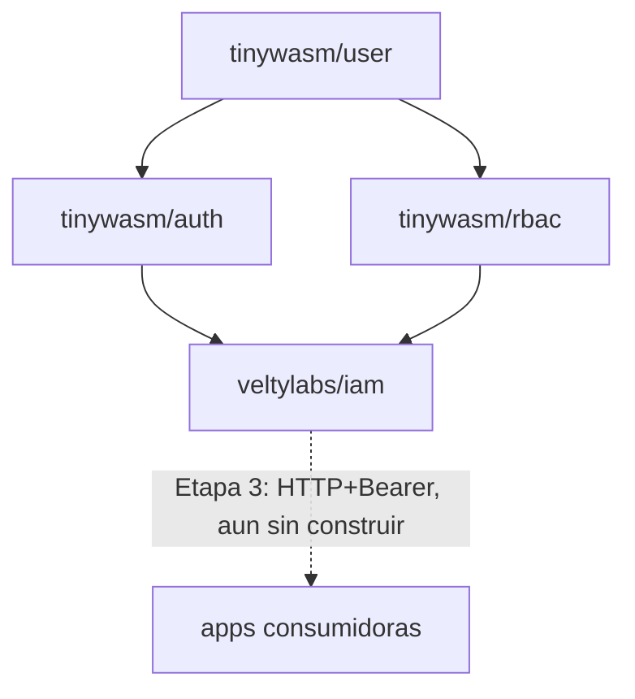

# Arquitectura de `iam`

Define **qué** es este servicio y **por qué** existe. El detalle ejecutable
de cómo se construye está en [`PLAN.md`](PLAN.md).

---

## 1. El problema

`tinywasm/user` / `tinywasm/auth` / `tinywasm/rbac` son librerías genéricas
(separadas en repos hermanos el 2026-08-23). Resuelven "no reescribir la
mecánica de login y permisos en cada app". No resuelven esto otro: **cada
app sigue siendo su propia raíz de composición**, con su propia base de
datos de usuarios/roles.

Evidencia concreta, verificada en código el 2026-08-24:

- `veltylabs/misitio/edge/main.go` monta `authority.Module` + `rbac.Service`
  in-process contra la D1 `veltydb` (ver
  [`edge/main.go`](https://github.com/veltylabs/misitio/blob/main/edge/main.go)).
- `veltylabs/mjosefa-cms` monta su propio auth contra postgres, con
  `github.com/tinywasm/user v0.0.38` — anterior al split de `auth`/`rbac`
  (`user` va hoy en `v0.3.11`). Cada app que se suma reimplementa el mismo
  cableado y diverge en versión.

`iam` es la raíz de composición **única**: construye el motor una sola vez
y lo expone por HTTP (Etapa 3) para que ninguna app nueva vuelva a montar
`authority.Module`/`rbac.Service` contra su propia base.

## 2. Qué NO es `iam`

- **No es un fork de `tinywasm/auth`/`tinywasm/rbac`.** Las importa sin
  modificarlas — ver [no-usar-`internal/`](#) (regla del ecosistema: un
  módulo propio no duplica una dependencia, la usa o le contribuye aguas
  arriba).
- **No reemplaza la autorización fina de negocio de cada app.** Ver §4.

## 3. Decisiones tomadas (2026-08-24)

Resueltas en conversación con el mantenedor antes de escribir código.

### 3.1 — Nombre: `veltylabs/iam`

*Identity and Access Management*: término estándar de la industria para un
servicio que junta login + RBAC + multi-proyecto. Va bajo `veltylabs/`, no
`tinywasm/`, porque no es un framework genérico reusable fuera de Velty
(como sí lo son `auth`/`rbac`) sino una decisión de infraestructura propia
de Velty — mismo patrón que `site_manager`/`site_content` (negocio) frente
a `tinywasm/*` (framework).

### 3.2 — SSO real entre subdominios

Una sesión iniciada en un proyecto debe servir automáticamente en los
demás: dominio compartido (`iam.velty.cl` u otro subdominio bajo
`*.velty.cl`) emite la sesión; cada app la valida vía cookie de dominio
padre `.velty.cl` o JWT. El usuario entra una vez y accede a todo lo que
tenga membresía.

**Consecuencia:** todo proyecto Velty futuro debe vivir bajo `*.velty.cl`
para participar del SSO. Un proyecto en dominio propio ajeno necesitaría un
mecanismo distinto (fuera de alcance por ahora).

**Estado:** decisión de alcance tomada; el mecanismo concreto (cookie de
dominio padre vs. JWT portado entre dominios) es la Etapa 4, todavía sin
diseñar en detalle.

### 3.3 — Roles con ámbito por proyecto

Cada asignación de rol lleva un `project_id`: un usuario puede ser admin en
`misitio` y no tener ningún rol en `mjosefa-cms`. Encaja con "una base de
datos para todos los proyectos" — permite que un mismo usuario tenga
distinto nivel de acceso en cada proyecto sin bases separadas.

**Estado: parcialmente resuelto.** La decisión de *producto* (roles
aislados por proyecto) está tomada. La decisión de *esquema* — cómo se
particiona físicamente `tinywasm/rbac` por proyecto sin modificar esa
librería (columna `project_id` compartida vs. una instancia lógica de
`rbac.Service` por proyecto sobre particiones de datos separadas) — **no
está tomada**. Es la Etapa 2. Ver §5.

### 3.4 — Límite de responsabilidad frente a `site_manager`

`misitio` ya tiene su propio nivel de autorización fino: `SiteMember` en
`veltylabs/site_manager` decide qué cliente administra qué sitio. `iam`
**no reemplaza eso**. `iam` resuelve únicamente:

1. "¿Quién eres?" (identidad, vía Google OAuth).
2. "¿Qué proyectos puedes usar y con qué rol general en cada uno?" (RBAC de
   alto nivel, con ámbito `project_id`).

La autorización fina de negocio (qué sitio administra este cliente, qué
plan tiene) se queda en `site_manager`, que sigue siendo quien la
consulta — solo que el motor de identidad que usa para resolver "qué
usuario es este" pasa a ser `iam` en vez de una copia local.

**Consecuencia práctica verificada en código:** `misitio/config/admin.go`
tiene hoy `EnsureAdminRoleRBAC`, que mezcla dos cosas — crear el rol
`Velty Admin` y asignarlo por email (mecánica genérica, sí pertenece a
`iam`) **y** crear los permisos `ResourceAccessReq`/`ResourceSite`
(política de negocio de `site_manager`, no pertenece a `iam`). La Etapa 1
solo porta la mecánica genérica; `misitio` sigue siendo quien declara sus
propios permisos, ahora llamando al cliente de `iam` en vez de a
`rbac.Service` local (ese cambio en `misitio` es un plan aparte, no
incluido aquí — ver §6).

## 4. Terminología: "proyecto" no es "tenant"

`misitio` ya usa la palabra **tenant** con un significado propio y
verificado en código: el cliente final de Velty, aislado por `site_id` vía
`SiteMember` (`veltylabs/misitio/tests/tenant_test.go`, casos T1-T3). Es un
nivel de aislamiento *dentro* de un proyecto.

`iam` introduce un nivel de aislamiento *entre* proyectos (`misitio` vs.
`mjosefa-cms` vs. futuros). Para no chocar con el significado ya
establecido, `iam` usa siempre la palabra **proyecto** (`project_id`) para
su propio nivel de ámbito, y nunca "tenant". Un lector que conozca ambos
repos no debe confundir "tenant de `iam`" con "tenant de `misitio`" —
son capas distintas.

## 5. Lo que queda deliberadamente abierto

No se decide por omisión: se documenta como pregunta pendiente.

- **Partición física de `project_id` (Etapa 2).** Dos candidatas: (a)
  columna `project_id` añadida a las tablas de `tinywasm/rbac` — requiere
  modificar esa librería compartida, afecta a todo consumidor existente
  (`misitio`, `site_manager`) que hoy la usa single-tenant; (b) una
  instancia lógica de `rbac.Service`/`authority.Module` por proyecto sobre
  una partición de datos propia (prefijo de tabla o esquema), sin tocar
  `tinywasm/rbac`. Requiere una ronda de Q&A propia antes de tener su
  `PLAN_STAGE_2_*.md`.
- **Forma exacta de la API HTTP (Etapa 3).** `tinywasm/mcp` ya tiene un
  plan sin ejecutar para esto —
  [`PLAN_bearer_auth_pending.md`](https://github.com/tinywasm/mcp/blob/main/docs/PLAN_bearer_auth_pending.md) —
  que anticipa `user.GenerateAPIToken`/`user.AuthModeBearer` como el
  mecanismo: un JWT opaco para el cliente, verificado por el servidor. Es
  el punto de partida de la Etapa 3, no algo a re-decidir desde cero.
- **Mecanismo exacto de sesión cross-dominio (Etapa 4).** Cookie de dominio
  padre `.velty.cl` vs. JWT portado entre subdominios — trade-offs de
  revocación y de acoplamiento a `*.velty.cl` sin decidir todavía.
- **Migración de `misitio` para consumir `iam` remotamente.** No es un plan
  de este repo — `misitio` es un repo distinto con su propio `docs/PLAN.md`.
  Este repo solo entrega el servicio; el consumo remoto por `misitio` es un
  plan futuro dispatchable dentro de `veltylabs/misitio`.

## 6. Dependencias

`iam` nunca modifica `tinywasm/auth` ni `tinywasm/rbac` — las usa como
cualquier otro consumidor del ecosistema. Si a `iam` le falta algo de esas
librerías, la función correcta se añade aguas arriba (al paquete real), no
se copia localmente.
