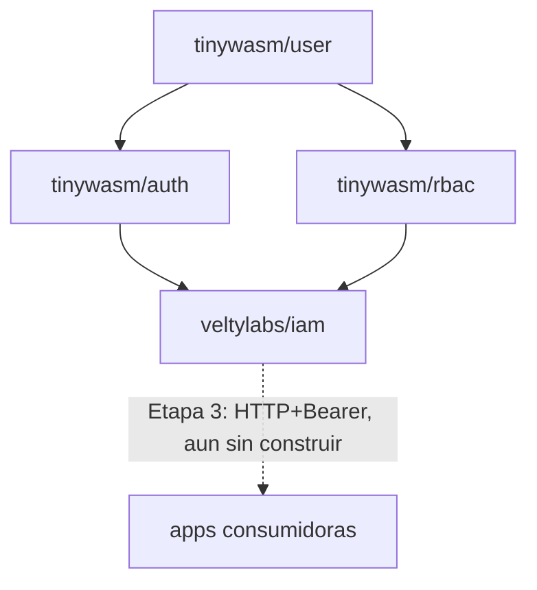

# Arquitectura de `iam`

Define **qué** es este servicio y **por qué** existe. El detalle ejecutable
de cómo se construye está en [`PLAN.md`](PLAN.md).

---

## 1. El problema

`tinywasm/user` / `tinywasm/auth` / `tinywasm/rbac` son librerías genéricas
(separadas en repos hermanos el 2026-08-23). Resuelven "no reescribir la
mecánica de login y permisos en cada app". No resuelven esto otro: **cada
app sigue siendo su propia raíz de composición**, con su propia base de
datos de usuarios/roles.

Evidencia concreta, verificada en código el 2026-08-24:

- `veltylabs/misitio/edge/main.go` monta `authority.Module` + `rbac.Service`
  in-process contra la D1 `veltydb` (ver
  [`edge/main.go`](https://github.com/veltylabs/misitio/blob/main/edge/main.go)).
- `veltylabs/mjosefa-cms` monta su propio auth contra postgres, con
  `github.com/tinywasm/user v0.0.38` — anterior al split de `auth`/`rbac`
  (`user` va hoy en `v0.3.11`). Cada app que se suma reimplementa el mismo
  cableado y diverge en versión.

`iam` es la raíz de composición **única**: construye el motor una sola vez
y lo expone por HTTP (Etapa 3) para que ninguna app nueva vuelva a montar
`authority.Module`/`rbac.Service` contra su propia base.

## 2. Qué NO es `iam`

- **No es un fork de `tinywasm/auth`/`tinywasm/rbac`.** Las importa sin
  modificarlas — ver [no-usar-`internal/`](#) (regla del ecosistema: un
  módulo propio no duplica una dependencia, la usa o le contribuye aguas
  arriba).
- **No reemplaza la autorización fina de negocio de cada app.** Ver §4.

## 3. Decisiones tomadas (2026-08-24)

Resueltas en conversación con el mantenedor antes de escribir código.

### 3.1 — Nombre: `veltylabs/iam`

*Identity and Access Management*: término estándar de la industria para un
servicio que junta login + RBAC + multi-proyecto. Va bajo `veltylabs/`, no
`tinywasm/`, porque no es un framework genérico reusable fuera de Velty
(como sí lo son `auth`/`rbac`) sino una decisión de infraestructura propia
de Velty — mismo patrón que `site_manager`/`site_content` (negocio) frente
a `tinywasm/*` (framework).

### 3.2 — SSO real entre subdominios

Una sesión iniciada en un proyecto debe servir automáticamente en los
demás: dominio compartido (`iam.velty.cl` u otro subdominio bajo
`*.velty.cl`) emite la sesión; cada app la valida vía cookie de dominio
padre `.velty.cl` o JWT. El usuario entra una vez y accede a todo lo que
tenga membresía.

**Consecuencia:** todo proyecto Velty futuro debe vivir bajo `*.velty.cl`
para participar del SSO. Un proyecto en dominio propio ajeno necesitaría un
mecanismo distinto (fuera de alcance por ahora).

**Estado:** decisión de alcance tomada; el mecanismo concreto (cookie de
dominio padre vs. JWT portado entre dominios) es la Etapa 4, todavía sin
diseñar en detalle.

### 3.3 — Roles con ámbito por proyecto

Cada asignación de rol lleva un `project_id`: un usuario puede ser admin en
`misitio` y no tener ningún rol en `mjosefa-cms`. Encaja con "una base de
datos para todos los proyectos" — permite que un mismo usuario tenga
distinto nivel de acceso en cada proyecto sin bases separadas.

**Estado: parcialmente resuelto.** La decisión de *producto* (roles
aislados por proyecto) está tomada. La decisión de *esquema* — cómo se
particiona físicamente `tinywasm/rbac` por proyecto sin modificar esa
librería (columna `project_id` compartida vs. una instancia lógica de
`rbac.Service` por proyecto sobre particiones de datos separadas) — **no
está tomada**. Es la Etapa 2. Ver §5.

### 3.4 — Límite de responsabilidad frente a `site_manager`

`misitio` ya tiene su propio nivel de autorización fino: `SiteMember` en
`veltylabs/site_manager` decide qué cliente administra qué sitio. `iam`
**no reemplaza eso**. `iam` resuelve únicamente:

1. "¿Quién eres?" (identidad, vía Google OAuth).
2. "¿Qué proyectos puedes usar y con qué rol general en cada uno?" (RBAC de
   alto nivel, con ámbito `project_id`).

La autorización fina de negocio (qué sitio administra este cliente, qué
plan tiene) se queda en `site_manager`, que sigue siendo quien la
consulta — solo que el motor de identidad que usa para resolver "qué
usuario es este" pasa a ser `iam` en vez de una copia local.

**Consecuencia práctica verificada en código:** `misitio/config/admin.go`
tiene hoy `EnsureAdminRoleRBAC`, que mezcla dos cosas — crear el rol
`Velty Admin` y asignarlo por email (mecánica genérica, sí pertenece a
`iam`) **y** crear los permisos `ResourceAccessReq`/`ResourceSite`
(política de negocio de `site_manager`, no pertenece a `iam`). La Etapa 1
solo porta la mecánica genérica; `misitio` sigue siendo quien declara sus
propios permisos, ahora llamando al cliente de `iam` en vez de a
`rbac.Service` local (ese cambio en `misitio` es un plan aparte, no
incluido aquí — ver §6).

## 4. Terminología: "proyecto" no es "tenant"

`misitio` ya usa la palabra **tenant** con un significado propio y
verificado en código: el cliente final de Velty, aislado por `site_id` vía
`SiteMember` (`veltylabs/misitio/tests/tenant_test.go`, casos T1-T3). Es un
nivel de aislamiento *dentro* de un proyecto.

`iam` introduce un nivel de aislamiento *entre* proyectos (`misitio` vs.
`mjosefa-cms` vs. futuros). Para no chocar con el significado ya
establecido, `iam` usa siempre la palabra **proyecto** (`project_id`) para
su propio nivel de ámbito, y nunca "tenant". Un lector que conozca ambos
repos no debe confundir "tenant de `iam`" con "tenant de `misitio`" —
son capas distintas.

## 5. Etapa 2 — `project_id` (CERRADA, 2026-08-24)

Se eligió (a): columna `project_id` nativa en las 4 tablas de
`tinywasm/rbac` (`Role`/`Permission`/`UserRole`/`RolePermission`), parte de
la clave primaria — no una partición paralela dentro de `iam`. Ejecutada
junto con la limpieza de la duplicación bidireccional que dejó el split
`user`/`auth`/`rbac`: ver
[[iam-bootstrap-and-rbac-split-cleanup]] (memoria) y
`tinywasm/rbac` `v0.0.3`. `TestProjectsAreIsolated` en `tinywasm/rbac/tests`
es la prueba que valida el aislamiento entre proyectos.

## 6. Etapa 3 — API Bearer para consumidores remotos (decisiones 2026-08-24)

### 6.1 — Dos tokens, no uno

Un solo JWT no puede servir ambos propósitos: la cookie de identidad
(Etapa 4) viaja a **todo** `*.velty.cl` y por tanto no puede llevar roles
de un proyecto específico — cualquier otro proyecto bajo el mismo dominio
la recibiría también. Se separan:

- **Token de identidad** (Etapa 4): solo `Sub`/`Exp`/`Iat` — prueba "quién
  eres", nada más. Es exactamente `tinyjwt.Claims`, sin cambios.
- **Token de autorización** (esta etapa): además de identidad, lleva
  `ProjectID` + `Roles` — una app lo pide a `iam` cuando lo necesita, nunca
  es la cookie compartida.

### 6.2 — El payload de autorización no se agrega a `tinyjwt.Claims`

`tinywasm/jwt`'s `Claims` declara explícitamente en su propio código:
*"Closed on purpose: the registered claims this ecosystem actually uses.
No `map[string]any` bag — that is how JWT libraries grow holes."* Agregarle
`ProjectID`/`Roles` violaría esa decisión ya tomada — verificado antes de
proponerlo, no después.

En su lugar, `tinywasm/jwt` gana una extensión **aditiva**: `Sign`/`Verify`
siguen existiendo sin cambios para el caso simple (`Claims` puro); un
`SignPayload`/`VerifyPayload` nuevo firma/verifica cualquier payload que
embeba `Claims` (vía una interfaz mínima `Base() Claims`, satisfecha
gratis por embedding — composición de Go, no reflexión). `iam` define su
propio tipo `AuthClaims{jwt.Claims; ProjectID string; Roles []string}` en
`auth/session/jwt` (mismo repo que ya tiene `GenerateAPIToken`) — reusa el
motor de firma HS256 sin que `tinywasm/jwt` conozca RBAC. Detalle
ejecutable en `PLAN_STAGE_3_BEARER_API.md`.

### 6.3 — TTL diferenciado por rol

`rbac.Role` gana un campo `SessionTTL int64` (0 = usar el default). El
default es **30 minutos**. Al emitir un token de autorización, `iam` usa
el **más restrictivo** (menor) entre los `SessionTTL` de los roles que el
usuario tiene en ese proyecto — cerrado por defecto: un rol sin
`SessionTTL` declarado no alarga la sesión de otro rol más sensible.

**Por qué no revocación explícita:** un TTL corto + renovación automática
acota la ventana de "rol revocado pero token aún vivo" a, como mucho, el
TTL vigente — sin necesitar una lista de tokens revocados consultada en
cada verificación. Se revisita si aparece un caso real que lo exija.

### 6.4 — Autenticación de la app: client credentials por proyecto

La cookie de identidad prueba quién es el **usuario**, no que la app que
la reenvía es realmente `misitio` y no un sitio impostor bajo el mismo
dominio padre. Cada proyecto registrado en `iam` recibe un `client_id` +
`client_secret` (estilo OAuth2 client credentials) al darse de alta. El
endpoint que emite el token de autorización exige ambas cosas: la cookie
de identidad (quién es el usuario) y el secreto del proyecto (qué app lo
pide). Sin el secreto, cualquier código bajo `*.velty.cl` podría pedir
tokens para un proyecto ajeno.

## 7. Etapa 4 — SSO cross-dominio (decisiones 2026-08-24)

- **Mecanismo:** cookie de dominio padre `.velty.cl`, no JWT portado por
  redirect. `router.Cookie` ya declara un campo `Domain` (sin usar hoy por
  `auth/session/jwt.Strategy`); `SameSite=Strict` funciona entre
  subdominios del mismo sitio registrable (`velty.cl`), así que no hace
  falta relajarlo a `Lax`/`None`. El navegador la envía solo a `*.velty.cl`,
  sin código adicional en cada app consumidora.
- **Subdominio de `iam`:** `iam.velty.cl` — coherente con el patrón ya
  usado (`misitio.velty.cl`), en la misma zona/cuenta Cloudflare "velty"
  (ver memoria `cloudflare-velty-cl-worker`).
- **TTL de la cookie de identidad:** 7 días — igual al `TTLSession` que ya
  usan `iam`/`misitio` para su cookie de sesión local hoy. No arriesga
  permisos obsoletos (no lleva roles), así que puede ser más largo que el
  token de autorización.

## 8. Lo que sigue quedando fuera de este repo

- **Migración de `misitio` para consumir `iam` remotamente.** No es un plan
  de este repo — `misitio` es un repo distinto con su propio `docs/PLAN.md`.
  Este repo solo entrega el servicio; el consumo remoto por `misitio` es un
  plan futuro dispatchable dentro de `veltylabs/misitio`, y depende de que
  la Etapa 3 de este repo exista primero.
- **Panel de administración de `iam`** (`web/client.go`, `modules/`) —
  mencionado en `AGENTS.md` Restricción #1 como parte legítima de este
  repo, pero sin diseñar todavía: qué gestiona exactamente (altas de
  proyecto, de client credentials, de roles) necesita su propia ronda de
  preguntas.

## 9. Dependencias

`iam` nunca modifica `tinywasm/auth` ni `tinywasm/rbac` — las usa como
cualquier otro consumidor del ecosistema. Si a `iam` le falta algo de esas
librerías, la función correcta se añade aguas arriba (al paquete real), no
se copia localmente.
